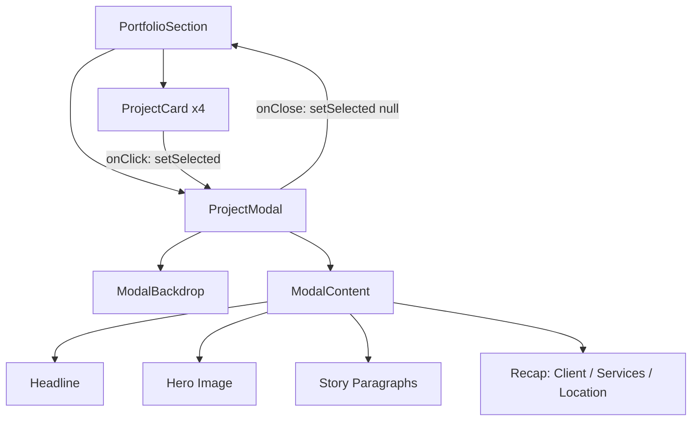

# Portfolio Section — Redesign avec Modale (Style Mads Matters)

## Objectif

Transformer la section Portfolio existante en une galerie de projets avec modale plein écran. L'utilisateur clique sur une carte projet pour voir une étude de cas immersive sans quitter la page.

## Référence

Mads Matters Agency — approche minimaliste, "vendre par l'exemple visuel".

---

## Architecture des Composants



### Fichiers impactés

| Fichier | Action |
|---------|--------|
| `src/components/PortfolioSection.tsx` | MODIFIER — Refactor des cartes + ajout state modale |
| `src/components/ProjectModal.tsx` | NOUVEAU — Composant modale plein écran |

---

## Modèle de Données

```typescript
interface PortfolioProject {
  id: string;
  name: string;           // Nom du client/projet (ex: "Cluck")
  tagline: string;        // Accroche courte pour la carte
  category: string;       // Service principal (ex: "Branding")
  location: string;       // Ville — Pays (ex: "Paris — FR")
  image: string;          // URL de l'image principale

  // Données modale
  headline: string;       // Titre impactant centré (ex: "The Gold Standard of Crunch")
  story: [string, string]; // Exactement 2 paragraphes de storytelling
  client: string;          // Nom du client pour le récapitulatif
  services: string[];      // Liste complète des services (ex: ["Branding", "UI-UX"])
}
```

---

## Design de la Galerie (Cartes)

### Structure de chaque carte
- **Image** : `aspect-ratio: 4/3`, coins arrondis `1.75rem`, overflow hidden
- **Titre** : Nom du projet, `font-heading`, bold, couleur `primary`
- **Tagline** : Phrase d'accroche, blanc, plus grande que le titre
- **Tags** : Pills avec catégorie + localisation, fond `primary`, texte `black-deep`
- **Hover** : Image scale `1.02`, apparition d'un cercle blanc avec icône `ArrowUpRight`

### Layout
- Grille 2 colonnes (desktop) / 1 colonne (mobile)
- Colonne droite décalée vers le bas (`mt-24` desktop)
- Stagger d'apparition des cartes au scroll

### Changements vs. existant
- Pas de changement structurel majeur sur les cartes
- Le `<a href="#cta-contact">` est remplacé par un `<button onClick>` qui ouvre la modale
- Le `data-cursor="explore"` est conservé

---

## Design de la Modale

### Ouverture
1. **Backdrop** : `position: fixed`, `inset: 0`, `z-index: 50`
   - Background : `rgba(11, 11, 11, 0.85)` avec `backdrop-filter: blur(8px)`
   - Animation : fade-in `opacity 0 → 1` en `300ms`

2. **Panel** : `position: fixed`, `inset: 0`, `z-index: 51`
   - Background : `#0B0B0B` (black-deep)
   - Animation : slide-up `translateY(100%) → translateY(0)` en `500ms` avec easing `[0.16, 1, 0.3, 1]`
   - `overflow-y: auto` pour le scroll interne
   - `overscroll-behavior: contain` pour bloquer le scroll parent

3. **Body scroll lock** : Ajouter `overflow: hidden` au `<body>` quand la modale est ouverte

### Bouton Fermeture
- Position : `fixed`, `top: 24px`, `right: 24px`, `z-index: 52`
- Style : Cercle `48x48`, fond `primary` (#08C1DC), icône `X` blanche
- Hover : `scale(1.1)`, shadow glow `rgba(8, 193, 220, 0.4)`
- Action : Ferme la modale + Touche `Escape`

### Contenu de la Modale (de haut en bas)

#### 1. Headline
- Texte centré, `font-heading`, `font-black`, uppercase
- Taille responsive : `clamp(2.5rem, 8vw, 6rem)`
- Couleur : blanc
- Padding top : `120px` (laisser de l'espace respirable)
- Max-width : `900px`, centré

#### 2. Image Hero
- Largeur : 100% du conteneur (max-width `1100px`, centré)
- `aspect-ratio: 16/9`
- Coins arrondis : `1.5rem`
- Marge top : `48px`
- Animation : fade-in + léger scale-up au chargement (`scale 0.97 → 1`, `opacity 0 → 1`)

#### 3. Storytelling
- 2 paragraphes côte à côte en desktop (grille 2 colonnes), empilés en mobile
- Max-width : `900px`, centré
- Marge top : `64px`
- Typographie : `font-sans`, `text-base md:text-lg`, couleur `white/70`, `leading-relaxed`
- Animation : fade-in staggeré (paragraphe 1 puis paragraphe 2, délai `100ms`)

#### 4. Récapitulatif Technique
- Grille de 3 colonnes (Client | Services | Localisation)
- Séparée du storytelling par un `border-top` subtil (`white/10`)
- Marge top : `64px`, padding top : `32px`
- Labels en `text-xs`, `uppercase`, `tracking-widest`, `white/40`
- Valeurs en `text-base`, `font-bold`, blanc
- Services affichés comme pills (même style que les tags de carte)
- Padding bottom : `80px`

---

## Animations (Framer Motion)

| Élément | Propriété | De → Vers | Durée | Easing | Délai |
|---------|-----------|-----------|-------|--------|-------|
| Backdrop | opacity | 0 → 1 | 300ms | ease-out | 0ms |
| Panel | translateY | 100% → 0% | 500ms | [0.16, 1, 0.3, 1] | 0ms |
| Headline | opacity, y | 0, 20px → 1, 0 | 450ms | [0.16, 1, 0.3, 1] | 200ms |
| Image | opacity, scale | 0, 0.97 → 1, 1 | 500ms | [0.16, 1, 0.3, 1] | 350ms |
| Story P1 | opacity, y | 0, 16px → 1, 0 | 400ms | ease-out | 500ms |
| Story P2 | opacity, y | 0, 16px → 1, 0 | 400ms | ease-out | 600ms |
| Recap | opacity, y | 0, 12px → 1, 0 | 400ms | ease-out | 700ms |
| Close btn | opacity | 0 → 1 | 300ms | ease-out | 400ms |

### Fermeture
- Panel : `translateY(0) → translateY(100%)` en `400ms`
- Backdrop : `opacity 1 → 0` en `250ms` (délai `150ms` pour synchroniser)

---

## Accessibilité

- `role="dialog"`, `aria-modal="true"`, `aria-labelledby` pointant vers le headline
- Focus trap : le focus reste dans la modale tant qu'elle est ouverte
- `Escape` ferme la modale
- Clic sur le backdrop ferme la modale
- `prefers-reduced-motion` : désactiver le slide-up, utiliser un simple fade
- Restauration du focus sur la carte cliquée après fermeture

---

## Responsive

| Breakpoint | Comportement |
|------------|-------------|
| Mobile (<768px) | Grille 1 col, story empilée, recap en 1 col, headline plus petit |
| Tablet (768-1024px) | Grille 2 col, story 2 cols, recap 3 cols |
| Desktop (>1024px) | Grille 2 col décalée, story 2 cols, recap 3 cols, headline max |

---

## Données des 4 Projets

```typescript
const projects: PortfolioProject[] = [
  {
    id: "studio-landing",
    name: "Studio Landing",
    tagline: "L'excellence digitale en première impression.",
    category: "Web Design",
    location: "Montréal — QC",
    image: "https://images.unsplash.com/photo-1460925895917-afdab827c52f?q=80&w=1200&auto=format&fit=crop",
    headline: "L'Excellence Digitale En Première Impression",
    story: [
      "Studio Landing avait besoin d'une présence en ligne qui reflète leur positionnement haut de gamme. Le défi : créer une expérience immersive dès le premier contact, tout en maintenant des performances techniques irréprochables.",
      "Nous avons conçu une landing page qui allie animation fluide et contenu stratégique, transformant chaque visiteur en prospect qualifié. Le résultat : un taux de conversion multiplié par 3 en deux mois."
    ],
    client: "Studio Landing Inc.",
    services: ["Web Design", "Développement", "Stratégie UX"]
  },
  {
    id: "aia-identity",
    name: "AIA Identity",
    tagline: "Une identité qui incarne l'innovation.",
    category: "Branding",
    location: "Paris — FR",
    image: "https://images.unsplash.com/photo-1558591710-4b4a1ae0f04d?q=80&w=1200&auto=format&fit=crop",
    headline: "Une Identité Qui Incarne L'Innovation",
    story: [
      "AIA cherchait à se repositionner sur le marché de l'intelligence artificielle avec une identité qui inspire confiance et avant-garde. L'ancienne marque ne reflétait plus l'ambition de l'entreprise.",
      "Nous avons développé un système visuel complet — du logo aux supports de communication — qui positionne AIA comme un leader incontournable de son secteur. Une identité pensée pour durer."
    ],
    client: "AIA Technologies",
    services: ["Branding", "Identité Visuelle", "Direction Artistique"]
  },
  {
    id: "ecommerce-lux",
    name: "E-commerce Lux",
    tagline: "Le luxe accessible en quelques clics.",
    category: "Digital Experience",
    location: "Genève — CH",
    image: "https://images.unsplash.com/photo-1523275335684-37898b6baf30?q=80&w=1200&auto=format&fit=crop",
    headline: "Le Luxe Accessible En Quelques Clics",
    story: [
      "E-commerce Lux souhaitait offrir une expérience d'achat en ligne qui rivalise avec le service en boutique. Chaque détail devait respirer l'élégance et le raffinement.",
      "Notre solution : une plateforme e-commerce immersive avec des micro-interactions soignées, une navigation intuitive et un tunnel d'achat simplifié. Le panier moyen a augmenté de 45%."
    ],
    client: "Lux Commerce SA",
    services: ["Digital Experience", "E-commerce", "UI Design"]
  },
  {
    id: "nectar",
    name: "Nectar Fragrance",
    tagline: "L'art de la fragrance réinventé.",
    category: "Branding",
    location: "Lyon — FR",
    image: "https://images.unsplash.com/photo-1541643600914-78b084683601?q=80&w=1200&auto=format&fit=crop",
    headline: "L'Art De La Fragrance Réinventé",
    story: [
      "Nectar Fragrance lançait une nouvelle gamme de parfums artisanaux et avait besoin d'une identité de marque aussi raffinée que ses créations. L'enjeu : se démarquer dans un marché saturé.",
      "Nous avons créé un univers visuel sensoriel, mêlant typographie élégante et palette de couleurs évocatrice. La marque a gagné 200% de visibilité sur les réseaux sociaux en trois mois."
    ],
    client: "Nectar Fragrance",
    services: ["Branding", "Packaging", "Stratégie Digitale"]
  }
];
```

---

## Checklist de Validation

- [ ] Les cartes de la galerie sont cliquables et ouvrent la modale
- [ ] La modale slide-up est fluide et performante
- [ ] Le bouton X et la touche Escape ferment la modale
- [ ] Le scroll du body est bloqué quand la modale est ouverte
- [ ] Le contenu de la modale est correct pour chaque projet
- [ ] Le design est responsive (mobile, tablet, desktop)
- [ ] `prefers-reduced-motion` est respecté
- [ ] Le focus est restauré après fermeture
- [ ] Aucune régression sur le reste de la section
